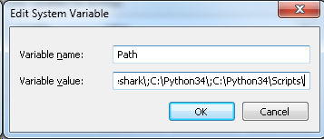
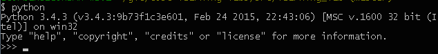
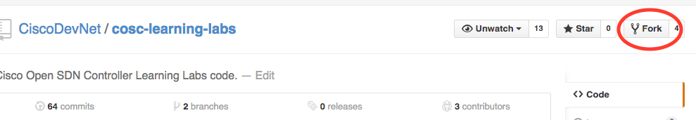
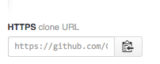

For some of our sample code, you will need to install [Python](https://www.python.org/downloads/) and [Pip](https://pip.pypa.io/en/latest/installing.html), and clone the project code.

#Windows
Mac OS X and Linux are quite similar in how one uses them for development. Windows has its own personality when it comes to developer tools though, so we have to treat Windows specially in these instructions. One of the very useful tools, which, if you are a Windows user you should install now, is [GitBash](https://github.com/msysgit/msysgit/releases/). GitBash usefully provides both a Git client and a Bash shell. Also see this guide to [installing GitBash](https://openhatch.org/missions/windows-setup/install-git-bash). The instructions we provide below for Windows work with GitBash.

#Install Python
We recommend that you install Python 3.x for your operating system. Download the installer here: https://www.python.org/downloads/.

On Windows Python is installed by default in `C:\Python34` (for Python 3). After having installed Python, you will need to add that location, and the location of the Scripts sub-directory (for Pip) to your path, as shown below.

 

##Check Your Python install
If you are using Mac OS X or Linux, enter `python3` to check the version, and expect to see something like:

```bash
$ python3 
Python 3.4.3 (v3.4.3:9b73f1c3e601, Feb 23 2015, 02:52:03) 
[GCC 4.2.1 (Apple Inc. build 5666) (dot 3)] on darwin
Type "help", "copyright", "credits" or "license" for more information.
>>> ^D
```
The `^D` shown above exits from the Python shell.

On Windows, open a Bash shell with GitBash and enter `python` at the CLI to check the Python version. If you have only installed Python3, and you have set the path as illustrated above, you should expect to see something like the example below.

 

# Install Pip
Pip is the [PyPA recommended tool](https://python-packaging-user-guide.readthedocs.org/en/latest/current.html) for installing Python packages. 

To install Pip for Python 3 on Mac OS X or Linux, use these commands at the CLI:

```bash
$ curl -O https://raw.githubusercontent.com/pypa/pip/master/contrib/get-pip.py
$ sudo python3 get-pip.py
```

And expect to see something like this:

```bash
$ curl -O https://raw.githubusercontent.com/pypa/pip/master/contrib/get-pip.py
  % Total    % Received % Xferd  Average Speed   Time    Time     Time  Current
                                 Dload  Upload   Total   Spent    Left  Speed
100 1387k  100 1387k    0     0   346k      0  0:00:04  0:00:04 --:--:--  346k

$ sudo python3 get-pip.py
Password:
...
Collecting pip
  Downloading pip-6.1.1-py2.py3-none-any.whl (1.1MB)
    100% |████████████████████████████████| 1.1MB 446kB/s 
Installing collected packages: pip
  Found existing installation: pip 6.0.8
    Uninstalling pip-6.0.8:
      Successfully uninstalled pip-6.0.8
Successfully installed pip-6.1.1
```

On Windows, Pip comes with Python 3.4, and is in the `Scripts` sub-directory of the Python install directory. If you added the `C:\Python34\Scripts` directory to your path as shown above, then you should be good.

# Installing Git
[Git](http://git-scm.com/) is a source code management (SCM) tool. There are many [Git UI tools available](http://git-scm.com/downloads/guis). The Git CLI client is installed with one of the platform specific [Git downloads](http://git-scm.com/downloads).

On Windows, you can use GitBash as recommended above. 

# Cloning the Code
Assuming you have a Git client installed, you can clone the project code. If you do not have a Git Client, see above. For a project hosted in GitHub, such as the [COSC Learning Lab](https://github.com/CiscoDevNet/cosc-learning-labs) you can [fork a repository](https://help.github.com/articles/fork-a-repo/) using the "Fork" button at the top right of a project page, as illustrated below.

 

Or you can just [clone a project](https://help.github.com/articles/cloning-a-repository/) using the URL copied to the clipboard as shown below:



The command to use the URL is the same for Linux, Max OS X or Windows. By convention, one clones Git projects into the `git` sub-directory of one's `$HOME` directory. These commands will work with a shell on Linux or Mac OS X and a GitBahs shell on windows:

```bash
$ cd $HOME
$ mkdir git
$ cd git
$ git clone <repository URL>
```
